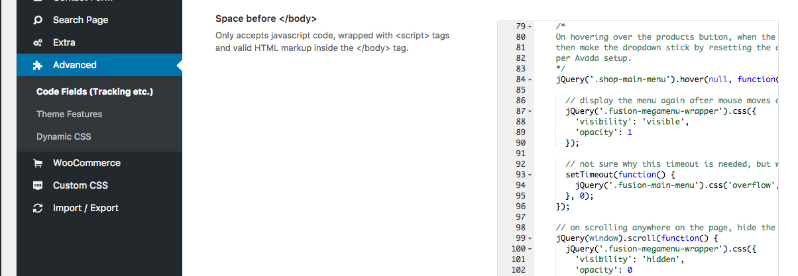

Some of you might notice that once you have created a fusion mega menu dropdown in Avada, once it appears, if you move your mouse just slightly out of its bounds, the dropdown will disappear.

This can be pretty frustrating when trying to navigate around the menu when it’s so easy for it to disappear.

So to create a sticky dropdown (it’ll stay open regardless where your mouse pointer is), and only closes once you start scrolling on the page, then this is the code for you.

<!--truncate-->

```html title="sticky-dropdown.html"
<script>
  // makes the dropdown sticky on hover and removes it on scrolling
  jQuery(document).ready(function () {

    /*
    On hovering over the products button, when the mouse is moved away,
    then make the dropdown stick by resetting the attributes to do that
    per Avada setup.
    */
    jQuery('.shop-main-menu').hover(null, function() {

      // display the menu again after mouse moves away
      jQuery('.fusion-megamenu-wrapper').css({
        'visibility': 'visible',
        'opacity': 1
      });

      // not sure why this timeout is needed, but without the attribute does not get changed
      setTimeout(function() {
        jQuery('.fusion-main-menu').css('overflow', 'visible');
      }, 0);
    });

    // on scrolling anywhere on the page, hide the dropdown
    jQuery(window).scroll(function() {
      jQuery('.fusion-megamenu-wrapper').css({
        'visibility': 'hidden',
        'opacity': 0
      });
      jQuery('.fusion-main-menu').css('overflow', 'hidden');
    })
  });
  </script>
```
[View this gist on GitHub](https://gist.github.com/magician11/dd8d9e2f487d12969de06847f99c903e)


Copy and paste the above code into the **“Space before `</body>`”** box found in

 Avada->Theme Options->Advanced->Code Fields (Tracking etc.)

 

 Any questions [let me know](/contact)!