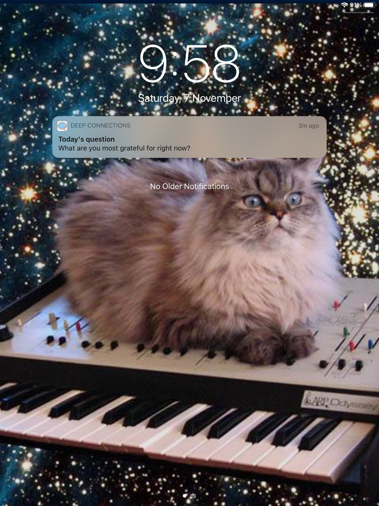

I’ve been working on a react native app called [Deep Connections](http://createdeepconnections.com/) on and off for a few years, and using it to test various technologies.

<!--truncate-->

I looked into getting push notifications working within an Ionic app I had built, but just found myself struggling too much with Android Studio and Xcode configurations.

So I decided to test out the push notifications in Expo, using my Deep Connections app as a test bed. I got it working, and this is how I did it.

The [Push Notifications Overview](https://docs.expo.io/push-notifications/overview/) in Expo docs are pretty good.

Firstly, we need to get a user’s Expo Push Token. Modifying the code from the docs, I created a module called `registerForPushNotificationsAsync.js` to include as the app starts up to get that token. And then I’ve created a minimalist function called `sendPushNotification.js` to demo how to take a message and an array of Expo Push Tokens to send out the same message to every Expo Push Token.

```js title="registerForPushNotificationsAsync.js"
import Constants from 'expo-constants';
import * as Notifications from 'expo-notifications';
import * as Permissions from 'expo-permissions';

const registerForPushNotificationsAsync = async () => {
  let token;
  if (Constants.isDevice) {
    const { status: existingStatus } = await Permissions.getAsync(
      Permissions.NOTIFICATIONS
    );
    let finalStatus = existingStatus;
    if (existingStatus !== 'granted') {
      const { status } = await Permissions.askAsync(Permissions.NOTIFICATIONS);
      finalStatus = status;
    }
    if (finalStatus !== 'granted') {
      alert('Failed to get push token for push notification!');
      return;
    }
    let res;
    try {
      res = await Notifications.getExpoPushTokenAsync();
      token = res.data;
    } catch (error) {
      alert(JSON.stringify(error));
    }
  } else {
    alert('Must use physical device for Push Notifications');
  }

  if (Platform.OS === 'android') {
    Notifications.setNotificationChannelAsync('default', {
      name: 'default',
      importance: Notifications.AndroidImportance.MAX,
      vibrationPattern: [0, 250, 250, 250],
      lightColor: '#FF231F7C'
    });
  }

  return token;
};

export { registerForPushNotificationsAsync };
```

```js title="sendPushNotification.js"
const { Expo } = require('expo-server-sdk');

module.exports = async (expoTokens, message) => {
  const messages = [];
  expoTokens.forEach(expoToken => {
    messages.push({
      to: expoToken,
      sound: 'default',
      body: message,
      title: "Hello!"
    });
  });

  const expo = new Expo();
  const chunks = expo.chunkPushNotifications(messages);
  for (const chunk of chunks) {
    const ticketChunk = await expo.sendPushNotificationsAsync(chunk);
    console.log(ticketChunk);
  }
};
```

[View this gist on GitHub](https://gist.github.com/magician11/d5ce0b4a4f1c5ce0e9e6ef32df068efc)

Once I have the Expo Push Token for a user, I store it in Firebase to use later to send push notifications with. Note that you can only retrieve an Expo Push Token from a physical device. This won’t work with simulators.

Expo has a neat [Push Notification Tool](https://expo.io/notifications), that you can immediately test out push notifications with the retrieved Expo Push Token. This will work fine while you’re developing within the Expo ecosystem.

If you’re going to deploy your app to the App and Play stores some extra setup needs to be done.

To setup Expo to work with Android, follow [this guide](https://docs.expo.io/push-notifications/using-fcm/) to configure Firebase Cloud Messaging, and how to upload server credentials to Expo.

And then finally to get Expo working for iOS, follow [these steps](https://docs.expo.io/push-notifications/push-notifications-setup/#credentials).