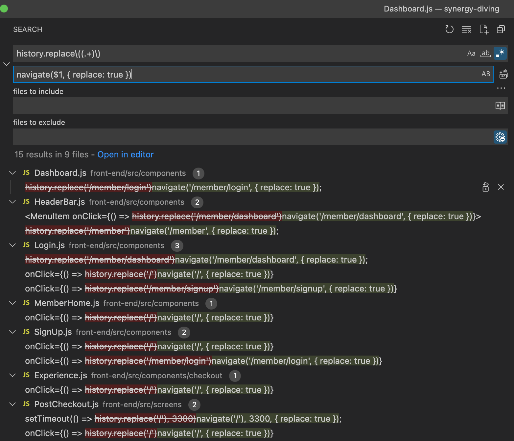

[I upgraded to V6 in React Router](https://reactrouter.com/docs/en/v6/upgrading/v5#use-usenavigate-instead-of-usehistory). One of the upgrades was to replace all occurrences of

```
history.replace('some-route');
```

with

```
navigate('some-route', { replace: true });
```

As you can see there is no simple way to do this as a normal text search and replace.

But in Visual Studio code you can use regular expressions to match, and then replace the text.

### Solution

So let’s say we have the above string **history.replace(‘/some-route’);** in a file.

In the Visual Studio Code search box, I have

```
history.replace\((.+)\)
```

Which means search for any instances of “history.replace”, take anything between the brackets, and store it in a variable called $1. “\(” means literally match a bracket. So this will set $1 to be **‘/some-route’**

And then the replace line is

```
navigate($1, { replace: true })
```

which takes the route matched in the above regular expression, and inserts it into this new string. Which will update the string to be **navigate(‘/some-route’, { replace: true });**

That’s it. This helps a lot when there are a lot of API updates to make.
