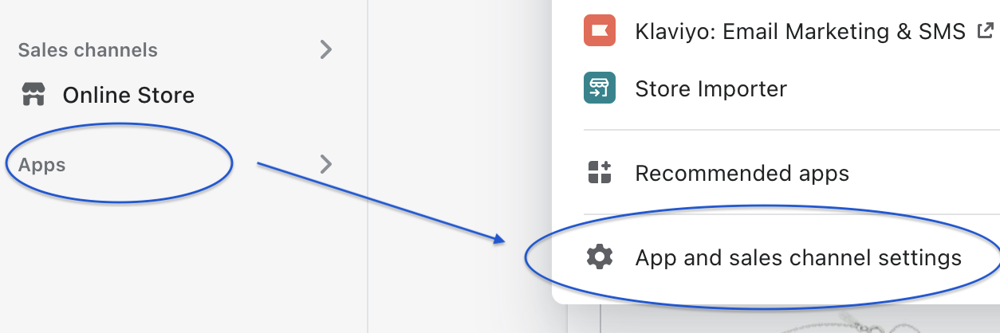
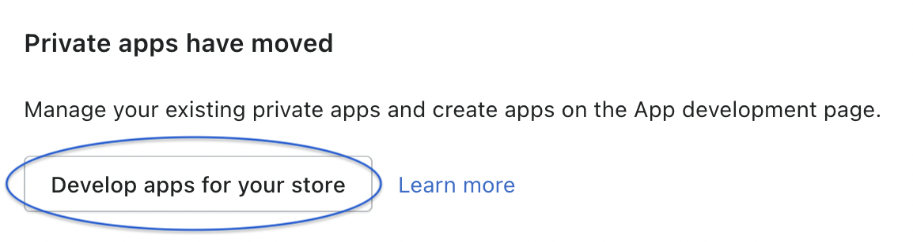
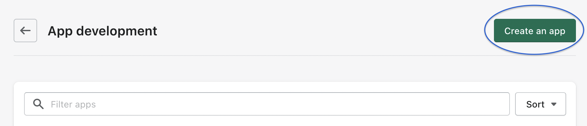
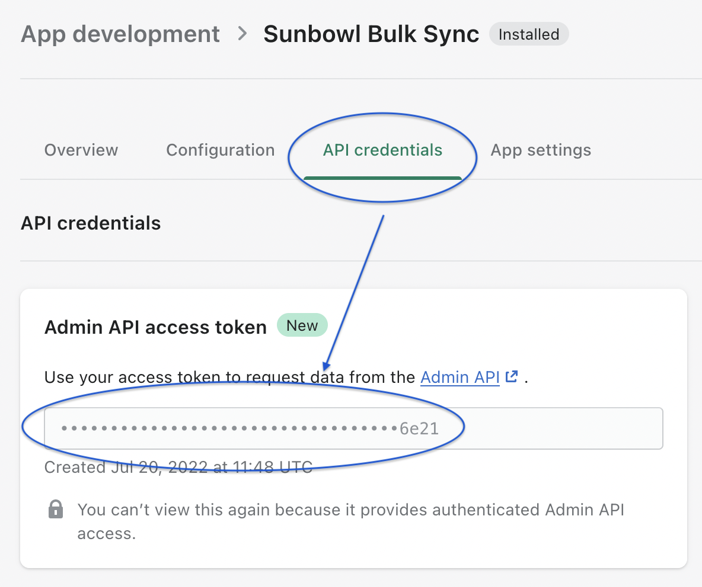

I use Node.js. So to programatically connect to Shopify’s [Admin API](https://shopify.dev/api/admin), I use the npm package [@shopify/shopify-api](https://www.npmjs.com/package/@shopify/shopify-api). The Admin API supports both [GraphQL](https://shopify.dev/api/admin/graphql) and [REST](https://shopify.dev/api/admin/rest).

I found the details on how to authenticate using the API was not very obvious though. This is how to do it.

### First we need to get an Admin API access token

1. Login to your Shopify Dashboard.
2. Go to _App and Sales channel settings_



3. Click _Develop apps for your store_



4. Then create a new app



5. And then copy the access token.



### Using the access token in your code

Let’s go through an example. Let’s say we want to fetch the first three products from the store using GraphQL.

I created a `.env` file that looks like this

```
ACCESS_TOKEN=shpat_xxxx.........e21
```

Then we just need to install two libraries

`yarn add @shopify/shopify-api dotenv`

Then our code will look as follows…

```js
import { Shopify } from '@shopify/shopify-api';
import * as dotenv from 'dotenv';
dotenv.config();

const test = async () => {
  const queryString = `{
        products (first: 3) {
          edges {
            node {
              id
              title
            }
          }
        }
      }`;

  const client = new Shopify.Clients.Graphql(
    'your-store.myshopify.com',
    process.env.ACCESS_TOKEN
  );
  const products = await client.query({
    data: queryString
  });
  console.log(products.body.data.products.edges);
};

test();
```

So in essence, from [the Shopify docs on authenticating](https://shopify.dev/api/usage/authentication), you don’t need to figure out the more complex flow of OAuth.
