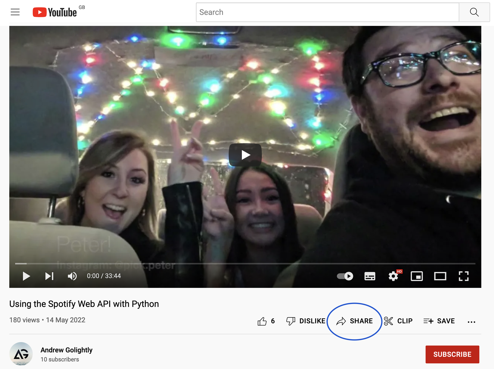
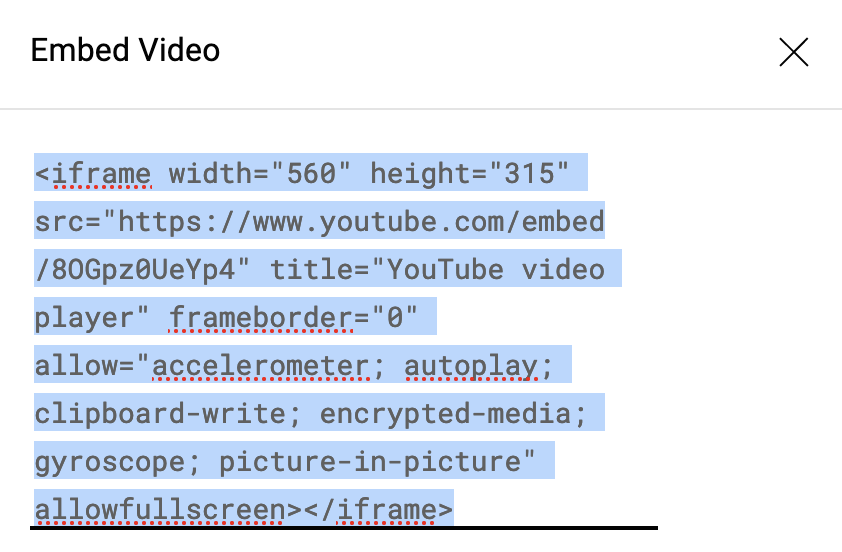
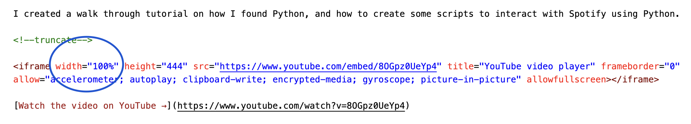

Embedding a YouTube video in a Docusaurus blog article is actually very easy to do. I just couldn't find any docs on it. This is how to do it.

<!--truncate-->

It basically involves getting the iframe code from YouTube for the video, and pasting it directly into the article.

1. Visit the YouTube video in a browser. e.g. https://www.youtube.com/watch?v=8OGpz0UeYp4
2. Click the share button

3. Click the embed button

4. Copy the iframe code

5. Paste in the iframe code into the article where you want the video to appear. Change the width value to "100%"; this will make the video span the full width of the page, and make it responsive for smaller screens.

All done!
