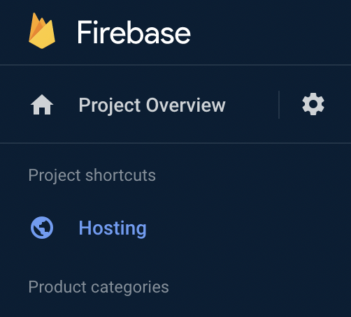
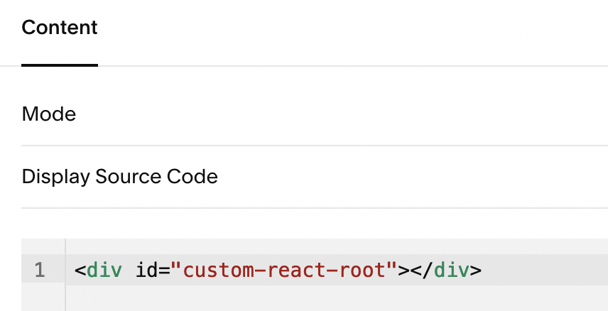

[Squarespace](https://www.squarespace.com/) is an excellent site to build a good looking website on. Even for an experienced developer who can build things from scratch, Squarespace does a lot of the basics well...

- Inserting text, images, videos, layouts easily with their page editing UIs.
- It's nice to not have to deal with the security and uptime of a website.
- And it's easy to hand off the site to a client for them to easily maintain.

Like with every site builder, they have their limitations. But what if we could embed any custom logic or app within a nice development experience? Like a [React](https://reactjs.org/) app maybe?

<!--truncate-->

Squarespace allows you to embed [code blocks](https://support.squarespace.com/hc/en-us/articles/206543167-Code-Blocks). This seems to work well for snippets, but for a full React app built using something like [Create React App](https://create-react-app.dev/), there are a few files and folders that make up the app. And Squarespace doesn't seem to have an easy mechanism to upload a directory of static files.

## The React app

Build your React app as per usual with Create React App ([getting started](https://create-react-app.dev/docs/getting-started)).

Then modify the `index.js` file to render to a different div id such as

```
const root = ReactDOM.createRoot(document.getElementById('custom-react-root'));
root.render(
  <React.StrictMode>
    <App />
  </React.StrictMode>
);
```

and for development also change the corresponding div id in the `public/index.html` file

```
<body>
  <noscript>You need to enable JavaScript to run this app.</noscript>
  <div id="custom-react-root"></div>
```

## Hosting the React app on Firebase

I found the answer was to host the React app on a server like [Firebase Hosting](https://firebase.google.com/docs/hosting/).



Take note of the custom hosting domain to be used for the embedded code later; something like `firebase-app.web.app`

## Embedding the React app on Squarespace

On the page you want to embed your React app, add a code block with the same div id as above



Then for the page you want the React app embedded into, [inject the below code snippet into the page](https://support.squarespace.com/hc/en-us/articles/205815908?platform=v6&websiteId=637538cf20578446ef895f03#toc-per-page-code-injection).

Notice how I'm including both the main CSS and the JS files.

```
<script type="text/javascript">
    (function (g, r, head, script) {
        head = r.getElementsByTagName("head")[0];
        script = r.createElement("script");
        script.async = 1;
        script.src = "https://firebase-app.web.app/static/js/main.cff0af87.js";

        head.appendChild(script);

    })(window, document);
</script>
<link href="https://firebase-app.web.app/static/css/main.e6c13ad2.css" rel="stylesheet">
```
